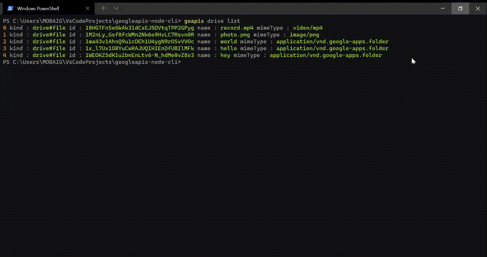

# googleapis-node-cli

This is a command line application written in node.js to consume popular google APIs.
### Demo


### Usage

make sure you have node & npm installed on your machine.
```shell
# clone the github repository
git clone https://github.com/sharief007/googleapis-node-cli.git

cd googleapis-node-cli

# install node dependencies
npm install

# globally install the goapis command
npm install -g .

# test the command
goapis --help
```

### TODOs
1. ~~Support for Google Drive API~~
2. Support for Gmail API
3. Support for Google people API